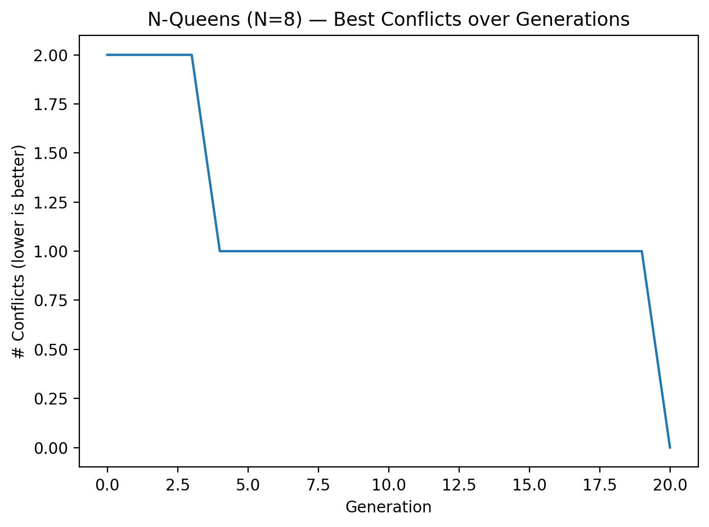
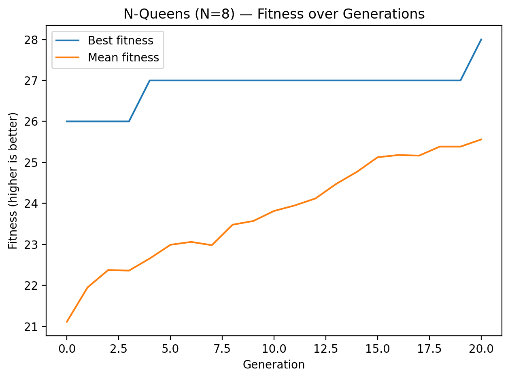

# N‑Queens with a Genetic Algorithm (PyGAD)

A compact, version‑robust PyGAD implementation of the N‑Queens problem with theory notes and publication‑ready plots. No `argparse`; tweak hyperparameters at the top of `main.py`.

---

## 📁 Project layout

```
.
├─ main.py            # GA solver using PyGAD only (version‑robust)
└─ docs/
   ├─ fitness.png     # Fitness curves (best & mean)
   ├─ conflicts.png   # Best # of conflicts per generation
   └─ board.png       # Final board rendering
```

## ⚙️ Requirements

* Python 3.9+
* Packages: `pygad`, `numpy`, `matplotlib`

Create a virtual environment with uv
```bash
uv init
```

Install with pip:

```bash
uv add pygad numpy matplotlib
```

## 🚀 Run

From the project root:

```bash
uv run main.py
```

This runs the GA and generates the three plots into `docs/` (and also displays them).

## 🧠 How it works (quick theory)

* **Encoding:** a solution is a length‑`N` vector `q` where `q[i]` is the **column** of the queen in **row `i`**.
* **Conflicts (a.k.a. collisions / attacking pairs):** two queens conflict if they share a **column** or a **diagonal**. We count conflicts in **O(N)** using frequency tables for columns and diagonals `(i - q[i])` and `(i + q[i])`.
* **Fitness (maximize):** let $M = N(N-1)/2$. We use `fitness = M − (#conflicts)`. A valid board has **0 conflicts ⇒ fitness = M**.
* **GA operators:** tournament selection (size `TOURNAMENT_K`), single‑point crossover, random‑reset mutation with probability `MUTATION_RATE` over `gene_space = {0..N‑1}`. Elitism preserves the top `ELITISM` individuals.
* **Early stop:** the run halts once best fitness reaches $M$.

## 🔧 Hyperparameters (edit in `main.py`)

```python
N = 8
POP_SIZE = 200
GENERATIONS = 600
TOURNAMENT_K = 4
MUTATION_RATE = 0.10
ELITISM = 6
RANDOM_SEED = 42  # set None for stochastic runs
```

### Pretty board options

`plot_board(sol, origin="top"|"bottom", labels="index"|"chess")`

* `origin="top"` keeps row 0 at top (matrix style); `"bottom"` is chess‑style.
* `labels="chess"` renders `a..h` files and ranks.

## 📊 Interpreting the plots

* **Final board** (`docs/board.png`): one queen per row and per column; no shared diagonals ⇒ 0 conflicts.
* **Best Conflicts** (`docs/conflicts.png`): the minimum # of conflicts in the population per generation; should step down to **0**.
* **Fitness curves** (`docs/fitness.png`): `best` mirrors conflicts (e.g., 28 ⇒ 0 conflicts for `N=8`); `mean` is the population average and typically trails the best.

## 🧪 Reproducibility

Set `RANDOM_SEED` to a fixed integer for repeatable runs. Use `None` to explore different trajectories.

## 🛠️ Troubleshooting PyGAD versions

This project supports PyGAD **2.20.0+** by introspecting `pygad.GA.__init__` and adjusting kwargs.

* If you see errors about `num_parents_mating`, `keep_parents` vs `keep_elitism`, or mutation arg names, ensure you’re using the provided `main.py`—it adapts at runtime.
* PyGAD 2.20.0 requires the fitness function to accept **3 parameters**: `(ga_instance, solution, solution_idx)`; our code follows this.

## ❓ FAQ

**Is this globally best?**  Any board with **0 conflicts** is globally optimal under our fitness (you can’t beat $M$). There are many 8‑queen solutions (92 distinct; 12 up to symmetry).

**Why is mean fitness lower than best?**  The average includes weaker individuals; the best curve reflects the top genome each generation. A gap is normal and indicates population diversity.

**If I nudge a queen one square, will it still be valid?**  Not from a perfect board: you’d land in an occupied column (and likely on an attacking diagonal), creating conflicts.

## 🧾 Example results (N=8)






---

